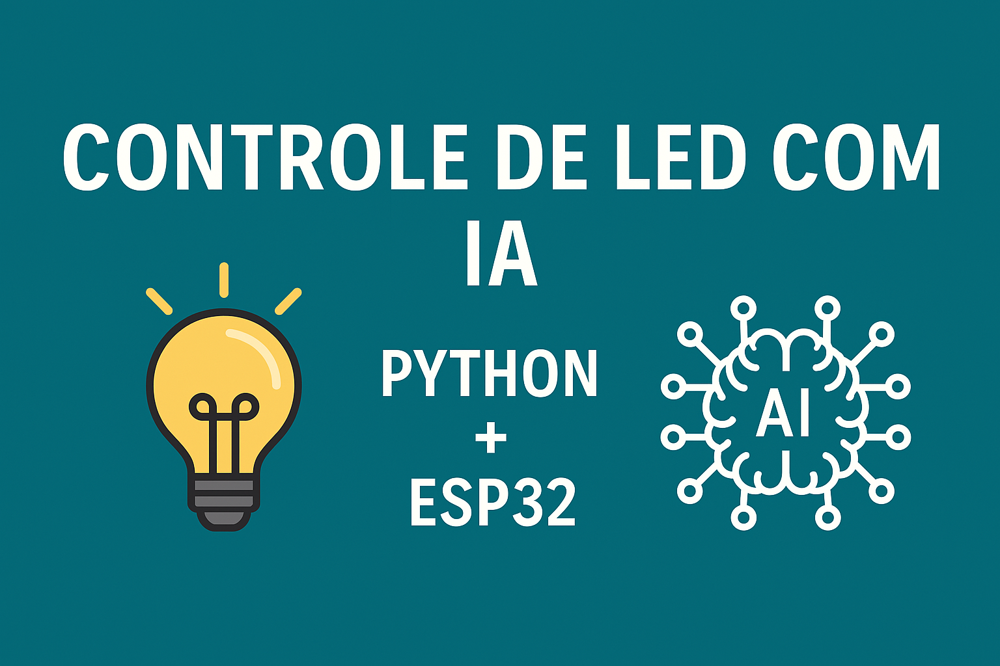

# led_quarto_ia
Controle de LED com IA em Pytho

# Controle de LED do Quarto com IA e ESP32

Este projeto permite controlar um LED via comandos de texto com uma IA simples em Python. Os comandos são enviados para um **ESP32 via Wi-Fi**, que acende ou apaga o LED de verdade.

---

## Funcionalidades

- IA simples interpreta comandos em linguagem natural (ex: "ligar a luz", "está escuro")
- Envio de comandos via rede para um ESP32
- Controle real de LED (pino 2 do ESP32)
- Compatível com rede Wi-Fi local

---

## Arquivos do projeto

- `main.py`: script em Python com interpretação de linguagem natural e envio de comandos
- `esp32_led_wifi.ino`: código Arduino que roda no ESP32 e controla o LED via socket TCP

---

## Como usar

### No ESP32
1. Suba o código `esp32_led_wifi.ino` usando a **Arduino IDE**
2. Altere o nome e a senha da sua rede Wi-Fi no código
3. Abra o monitor serial e anote o IP do ESP32

### No Python (pelo PC ou celular com Pydroid)
1. Instale Python e a biblioteca `socket` (já vem por padrão)
2. Rode o `main.py`
3. Digite comandos como `ligar a luz` ou `desligar o quarto`
4. O ESP32 executa o comando e responde

---

## Futuras melhorias

- Reconhecimento de voz
- Interface gráfica ou app Android
- Controle por Telegram ou Alexa
- Sensor de luz para controle automático

---

## Licença

Este projeto é livre para fins educacionais. Feito com propósito de aprendizado e experimentação em IoT e Inteligência Artificial.
